# 活动互评 UI 修改前后审查

推荐打开 [完整图文对比](comparison.html)，或 [PDF 版本](comparison.pdf)。

- 修改前基线：`e1d13c1`；修改后：本次提交组件。
- 截图为浏览器渲染的真实组件，采用虚构身份与演示外壳；旧页面比较受影响区域，并非真实账号 Production 全页截图。
- 服务端动作使用测试替身；SQL、权限及正式库迁移另外核验。
- 图中互评开放窗口为演示，不代表真实活动已确认到场或开放。

## 首页快捷入口

| 修改前 | 修改后 |
|---|---|
| 原入口为“待互评”，数量固定为 0。 | 改为“活动互评”，按当前可互评活动数显示角标。截图只展示首页快捷操作组件。 |
|  |  |

## 参与记录卡片

| 修改前 | 修改后 |
|---|---|
| 报名卡片只能查看报名记录。 | 新增“评价本场玩家”，已截止或暂停时变为查看入口。截图为实际参与记录卡片组件。 |
|  |  |

## 报名记录详情

| 修改前 | 修改后 |
|---|---|
| 活动说明与报名记录详情没有活动互评入口。 | 新增互评状态、已评价人数及进入按钮。截图中活动内容来自实际 RoundDetails；底部报名记录为演示占位，非 Production 全页快照。 |
| 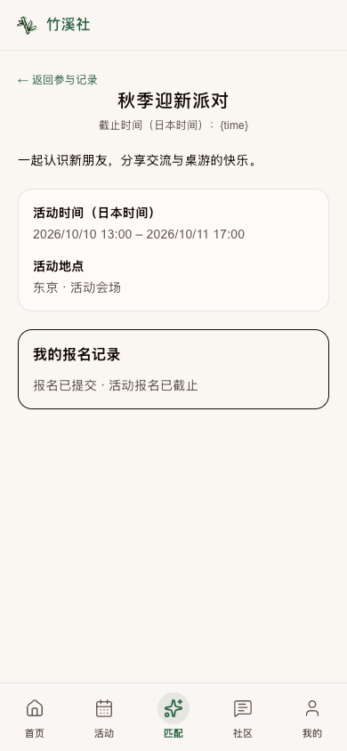 | 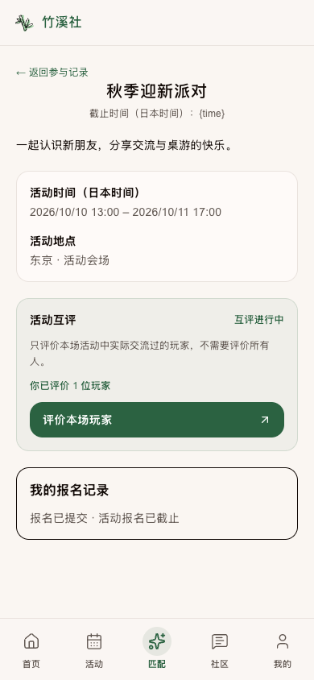 |

## 后台报名轮次

| 修改前 | 修改后 |
|---|---|
| 轮次管理提供报名、名单和原有操作。 | 新增活动互评概览与管理入口，侧栏运营区新增“活动互评”。轮次时间与数据均为演示场景。 |
| 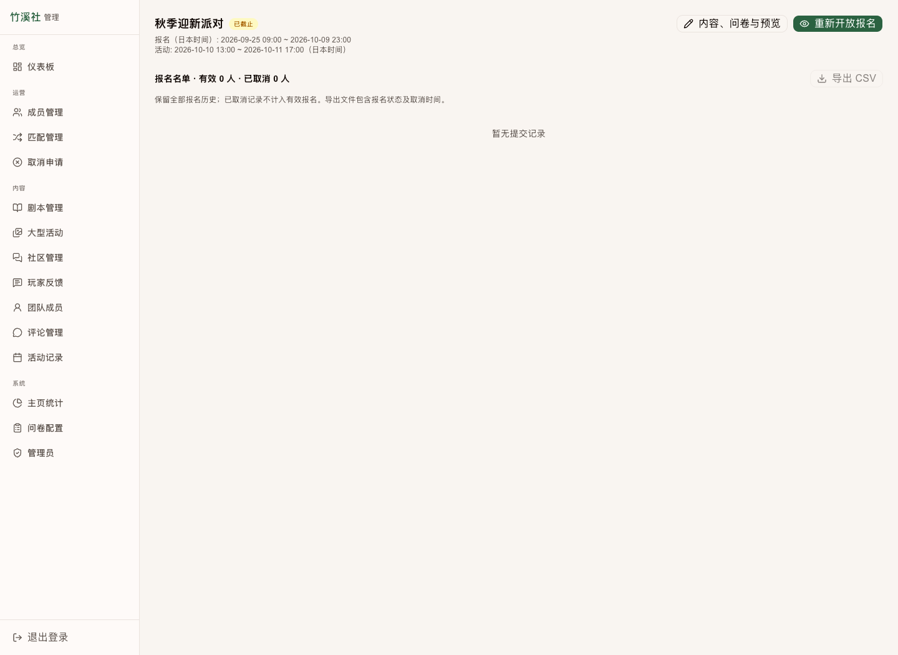 | 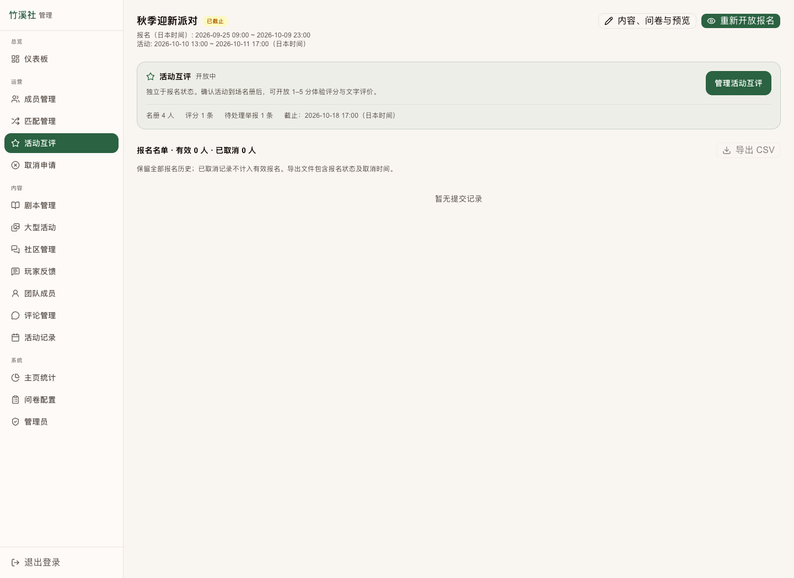 |

## 玩家名单与身份检索

首次进入不默认选择任何分数。姓名与昵称同时显示，同名玩家保留各自成员 ID。名单检索与分页由数据库执行。

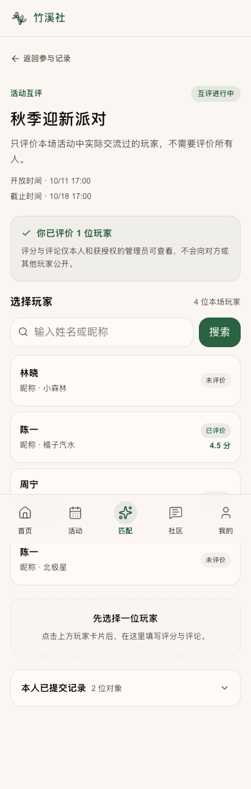

## 九档评分与评论

1.0、1.5、2.0、2.5、3.0、3.5、4.0、4.5、5.0；评论选填且最多 500 字。此图展示选择 4.5 分后的实际表单。

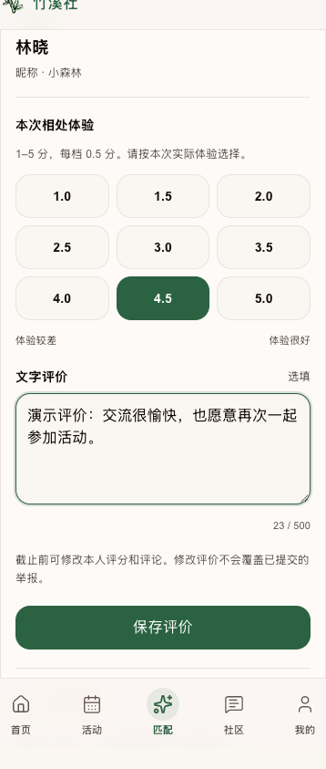

## 举报前确认

点击红色感叹号先确认玩家；继续只展开表单，不直接发送举报。

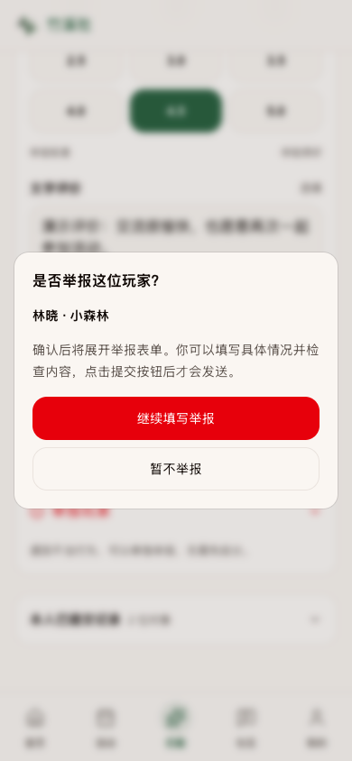

## 隐藏举报表单展开

举报类型和具体信息在确认后出现。可仅举报，也可保存评价并提交举报；组合提交使用原子 RPC。

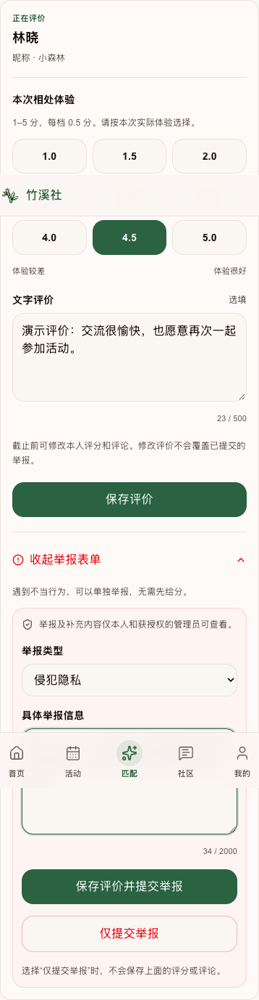

## 保存后本人记录

保存成功回填版本和状态。举报原文保持，后续追加补充；其他玩家无法看到。

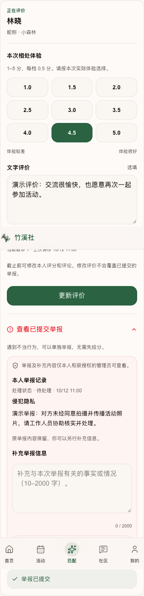

## 评分截止状态

停止新增与修改评分；本人历史仍可查看。曾实际开放且资格仍有效时允许举报。

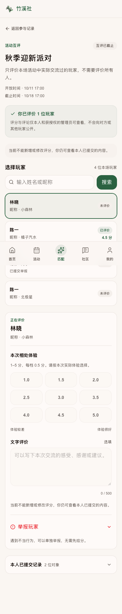

## 日文与手机布局

新增玩家文案同时提供中文与日文。已检查 390 px 视口无横向溢出。

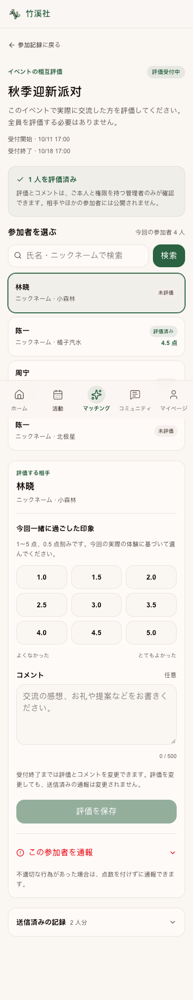

## 后台互评工作区

活动概览、开放时间、到场名册、评分审核、举报审核与历史集中管理。人数与内容均为虚构演示。

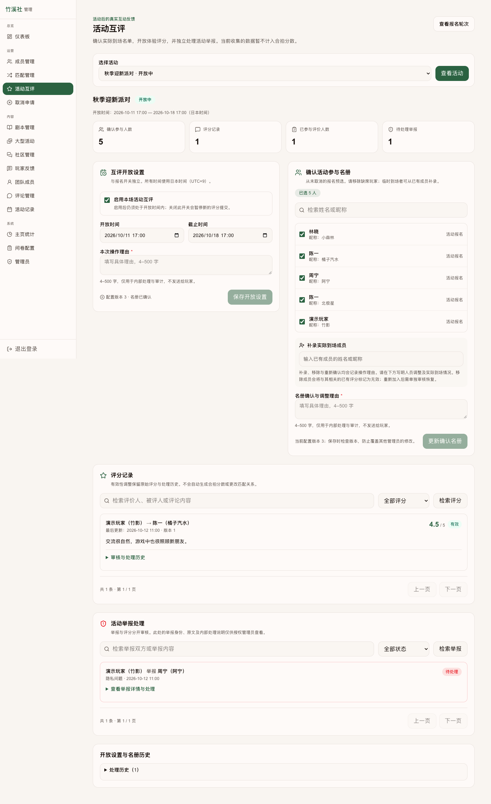

## 后台举报处理

查看原文及补充，记录处理状态、内部说明和操作理由。内部说明不返回玩家端。

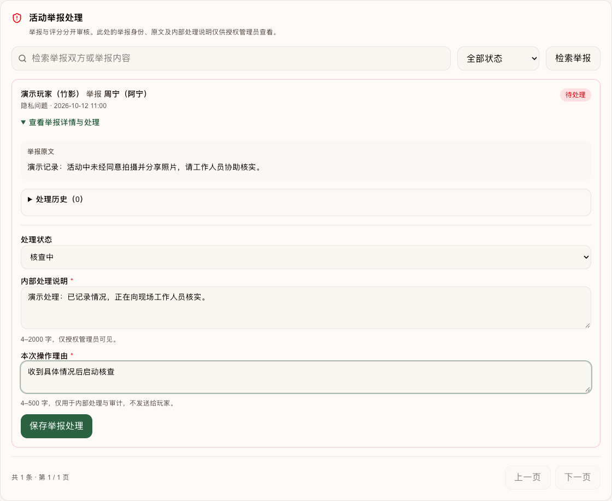

## 重现方式

保存基线到 `/tmp/zhuxi-peer-review-before`（`git archive e1d13c1`），链接当前 `node_modules`，分别运行 `node scripts/activity-reviews/visual-review.mjs before` 与 `node scripts/activity-reviews/visual-review.mjs after`。默认仅监听本机 3198/3199；screen 参数支持 home、detail、admin-round、reviews、editor、closed、admin，locale=ja 可看日文。演示路由不会部署进 Next.js。

完整业务规则、页面范围和后台操作见 [功能与运营说明](../../engineering/activity-peer-reviews.md)。
