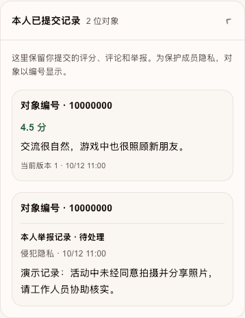
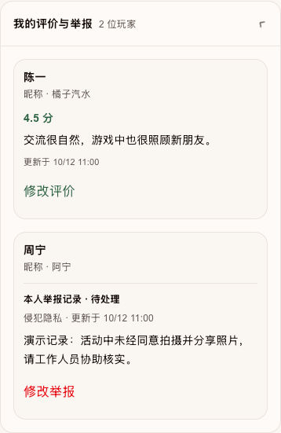
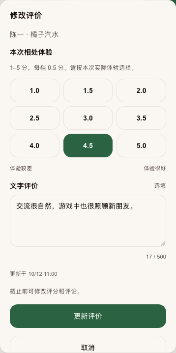
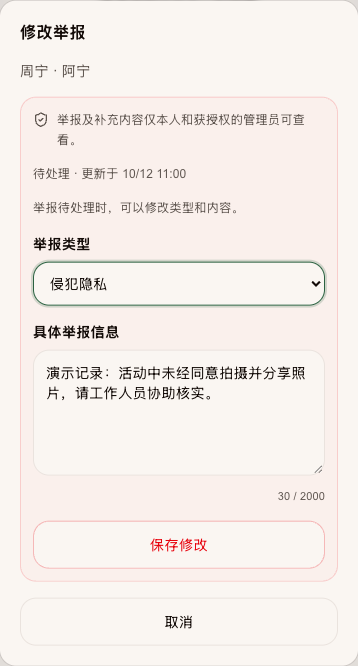
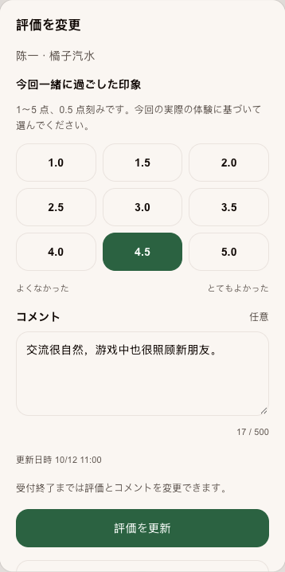

# 活动互评提醒与历史记录更新审查

日期：2026 年 10 月 3 日，日本时间。修改前代码为 `ef14af9`，修改后为本次提交的组件。

此次更新让已参与互评的玩家不再收到重复提醒，并能直接从“我的评价与举报”修改自己的提交。截图采用浏览器渲染的真实组件和虚构数据，宽度为 390 px；服务端动作使用本地测试回调，不是正式登录玩家的写入截图。数据库行为另以真实 SQL 隔离测试和正式库只读检查验证。

## 行为对比

| 项目 | 修改前 | 修改后 |
|---|---|---|
| 首页角标和优先提醒 | 只要活动可互评就一直提醒 | 本人提交任意一条评分或举报后取消该场提醒；既有记录自动适用 |
| 常驻入口 | 评价本场玩家 | 已提交时显示继续评价，截止后仍可查看 |
| 历史对象 | 对象编号 | 权限允许时显示姓名、昵称；不可见时显示玩家信息暂不可用 |
| 历史信息 | 当前版本、内容和时间 | 内容、处理状态和更新时间，隐藏内部编号及版本 |
| 修改评价 | 重新搜索选择玩家 | 历史记录直接打开带原值的弹窗，更新评分与评论 |
| 待处理举报 | 只能追加补充 | 可修改类别和正文，后台保留修订历史 |
| 处理中及已处理举报 | 上方玩家表单追加补充 | 历史记录直接补充或更正，保留原文并重新进入待处理 |
| 搜索和分页 | 历史记录无法直接选人 | 独立返回全部本人历史对象及其权限，不受当前名单页影响 |

## 已提交记录

两张截图使用相同数据：上方搜索没有匹配玩家，但历史仍有一条评价和一条举报。

| 修改前 | 修改后 |
|---|---|
|  |  |

## 直接修改评价

点击“修改评价”自动带入原评分和评论。保存后更新原记录，不新增重复评价；取消不保存。评分仍受互评时间和参与资格限制。

## 修改待处理举报

待处理状态可修改举报类型和具体内容，评分不会同时被保存或改动。进入处理流程的举报改为“补充或更正”，后台保留原始依据及每次更新。

## 日文界面

中日文同时更新；示例中的玩家姓名及评论属于虚构输入内容，保留其输入语言。

## 验证与发布

- 全量单测 155 个文件、1161 项通过；类型检查、ESLint、生产构建通过。首次沙箱构建停留在编译阶段，终止后在正常联网环境重跑成功，未修改字体配置。
- PGlite 隔离 PostgreSQL 测试 143 项通过，覆盖旧数据升级、全部历史对象跨搜索分页、权限与身份脱敏、举报修订、版本冲突、重试去重及匿名化后的审计清理。隔离测试不等同多连接并发压力测试。
- 浏览器验证了中文和日文 390 px 布局，未发现横向溢出；跨页历史记录能打开编辑，评价更新、待处理举报修改、处理中举报补充的提交参数及保存后刷新正确；浏览器错误日志为 0。
- 正式库 `wjjhprflldvclulistcx` 已追加 `20261003042356_peer_review_history_and_pending_report_edits.sql`，发布预演仅包含这一条。已有互评设置、评价和举报不被迁移改写；未写入测试评价或举报。
- 正式库只读核验 37 项全部通过，另外确认迁移已登记、提交标记及历史对象接口已安装，详见 [数据库核验](database-postflight.json)。
- 安全扫描 205 → 206，新增项仅为明确授权登录用户调用的新 `SECURITY DEFINER` RPC 提示；函数内再次校验本人身份、双方资格、举报状态与版本，匿名用户不可执行，私有表未开放直接读写。
- Git 提交、远端推送及对应部署状态见本次会话交付记录。未进行真实登录玩家的 Production 写入验收。

完整运营与权限说明见 [活动互评功能与运营说明](../../../engineering/activity-peer-reviews.md)。首次功能上线的历史截图仍保留在上级目录，不覆盖旧审查证据。
